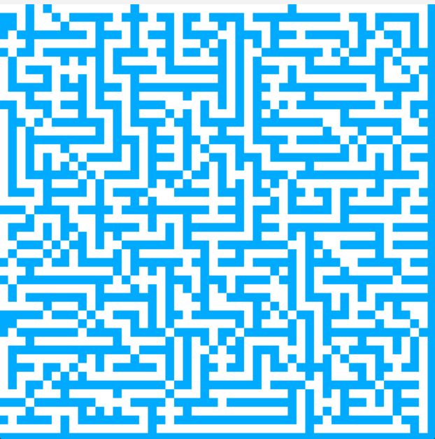

# Maze Generator

This program generates a maze using a recursive backtracking algorithm and visualizes it using the SDL2 library. The maze is displayed in a window, and the user can generate a new maze by pressing the spacebar.

## Program Output

When you run the program, you will see a window titled "Maze renderer" displaying a grid of cells. Initially, all cells are filled with blue color, indicating that they are unvisited.

To generate a new maze, press the spacebar. The program will then use the recursive backtracking algorithm to generate the maze and display it in the window. The generated maze will have a path from the top left corner to the bottom right corner, with walls blocking other paths.

The generated maze is shown using red and black colors. The red cells represent the path from the starting point to the ending point, and the black cells represent the walls of the maze.

## Controls

- Spacebar: Generate a new maze

## Dependencies

- SDL2: The program requires the SDL2 library to handle window creation, rendering, and event handling.

## Build and Run

1. Make sure that you have a folder named "src" under which the SDL2 includes and libraries are present.
2. This program uses MingW32 for compilation, as it is **windows based**.
3. Use the Makefile to compile: `make`
4. Run the program:
`./maze`

## Example Output

This is an example of the program's output showing a generated maze.
